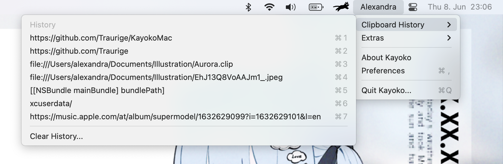

# KayokoX
Clipboard manager for macOS.

## WIP
KayokoX is in development and may not work in its current state if compiled manually.
Please come back later for a release!

## Preview

## Installation
1. Download the latest `dmg` from the [releases](https://github.com/vyolit/KayokoX/releases)
2. Drag KayokoX into the `Applications` folder

## Compatibility
Mac running macOS 11 or later.

## License
[GPLv3](https://github.com/vyolit/KayokoX/blob/main/COPYING)
